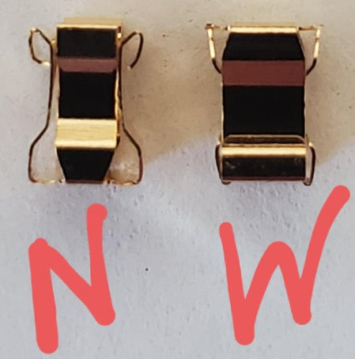
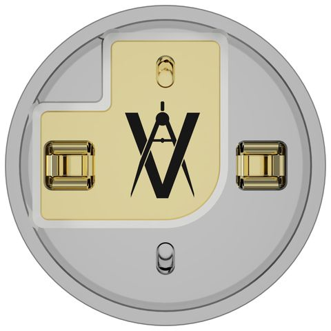

Spring clips are the consumable component of the M22 + ESCC system. Two spring clips hold the posts of the ESCC in place in the M22 atomizer base.

Spring clips have two "narrow" sides and two "wide" sides.

The wide sides of the clip should be perpendicular to the AVS logo on the M22. The narrow sides of the clip should be parallel to it.

## Official Method

 1. Grab a clip with ceramic tweezers. Orient it the correct way and position it over the M22.
 2. Position the clip so that it is above one of the two clip holes.
 3. Using the tweezers to keep the clip in place, push down on the clip using a finger until it seats correctly.
 4. Use the tweezers to push down on the wide sides of the clip until they are under (not flush with) the clip holes.
 5. Repeat the process for the second clip.

With the V1 ESCC, it is sometimes recommended to use tweezers to "spread" the narrow sides of the clip apart as much as possible. This is not recommended with the V2 ESCC.

## Unofficial Methods

### TacticalFleshlight's Method

 1. Put the zirc on the cup.
 2. Install the clips on the legs, making sure they are in the proper orientation.
 3. Position the cup/zirc/clips over the deck.
 4. Do a spot-check to make sure the clips are square.
 5. Push everything straight down.
